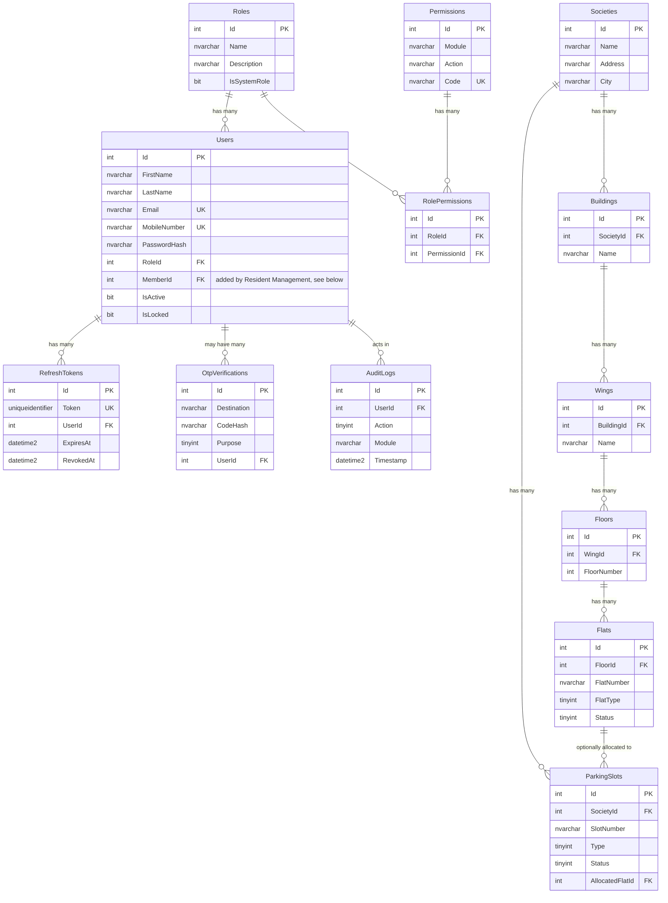
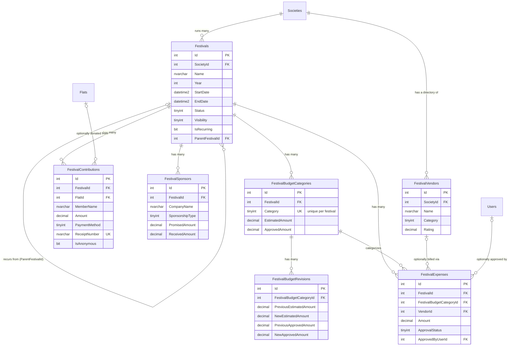
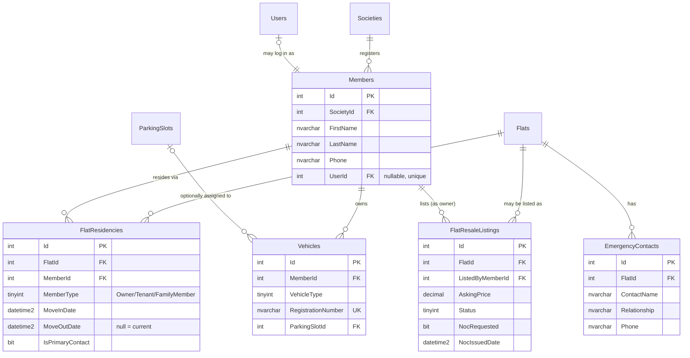

# Foundation Schema — Entity Relationship Diagram

Covers Identity/RBAC and Society Setup, the tables created by
`Database/Schema/01_CreateSchema.sql`. Renders as a diagram in any Markdown
viewer that supports Mermaid (GitHub, GitLab, VS Code with the Mermaid
extension, etc.).



Every table above additionally carries `CreatedAt, CreatedBy, ModifiedAt,
ModifiedBy, IsDeleted, DeletedAt, DeletedBy` (omitted from the diagram for
readability) except `AuditLogs`, which is intentionally append-only with no
soft-delete columns.

Future modules extend this diagram rather than replacing it — see the
"Resident Management" section below for the `Members` table and how
`Users.MemberId` now carries a real FK (its own section, since it's a
denser diagram than fits cleanly merged into this one).

## Festival & Event Management — Phase 1 (Foundation)

Tables created by `Database/Schema/02_CreateFestivalSchema.sql`. Every
festival is an independent project with its own budget, contributions,
sponsors, expenses; the vendor directory is society-scoped and reused across
festivals/years. `FestivalVendors` and the `ApprovedByUserId` FK connect back
into the diagram above (`Societies`, `Users`); `FestivalContributions.FlatId`
connects back into `Flats`.



`ActualAmount` for a budget category and `TotalPayments`/`OutstandingAmount`
for a vendor are deliberately not columns — both are always computed from
`FestivalExpenses` at query time so they can never drift from the underlying
transactions.

## Maintenance Management — Module 1

Tables created by `Database/Schema/03_CreateMaintenanceSchema.sql`, plus
three owner-contact columns added directly to the existing `Flats` table
(`OwnerName`/`OwnerPhone`/`OwnerEmail` — a pragmatic stand-in for Member
Management, which doesn't exist yet). `MaintenanceCategories` are recurring
society-wide charge lines every flat gets billed for each cycle;
`SpecialCharges` and `FineRecords` are per-flat. `MaintenanceBills` snapshot
the owner name/phone at generation time so an invoice can't silently change
if the flat's contact info is edited later.

```mermaid
erDiagram
    Societies ||--o{ MaintenanceCategories : "defines"
    Societies ||--|| MaintenanceSettings : "configures"
    Flats ||--o{ SpecialCharges : "has"
    Flats ||--o{ FineRecords : "has"
    Flats ||--o{ MaintenanceBills : "billed for"
    MaintenanceBills ||--o{ MaintenanceBillItems : "itemizes"
    MaintenanceBills ||--o{ MaintenancePayments : "paid via"
    MaintenanceCategories |o--o{ MaintenanceBillItems : "sources"
    SpecialCharges |o--o{ MaintenanceBillItems : "sources"
    FineRecords |o--o{ MaintenanceBillItems : "sources"
    Users |o--o{ MaintenancePayments : "recorded by"

    MaintenanceCategories {
        int Id PK
        int SocietyId FK
        nvarchar ChargeName
        tinyint ChargeType
        decimal MonthlyAmount
        bit IsActive
        int DisplayOrder
    }
    MaintenanceSettings {
        int Id PK
        int SocietyId FK UK
        int BillGenerationDay
        int DueDay
        int GracePeriodDays
        decimal LateFeeAmount
        nvarchar InvoiceNumberPrefix
        int NextInvoiceNumber
    }
    SpecialCharges {
        int Id PK
        int FlatId FK
        nvarchar ChargeName
        decimal Amount
        tinyint Frequency
        bit IsActive
    }
    FineRecords {
        int Id PK
        int FlatId FK
        nvarchar Reason
        decimal Amount
        tinyint Status
    }
    MaintenanceBills {
        int Id PK
        int FlatId FK
        datetime2 BillMonth
        nvarchar InvoiceNumber UK
        decimal PreviousBalance
        decimal TotalAmount
        decimal AmountPaid
        tinyint Status
        nvarchar OwnerNameSnapshot
        nvarchar OwnerPhoneSnapshot
    }
    MaintenanceBillItems {
        int Id PK
        int MaintenanceBillId FK
        nvarchar Description
        decimal Amount
        tinyint ItemType
    }
    MaintenancePayments {
        int Id PK
        int MaintenanceBillId FK
        decimal Amount
        datetime2 PaymentDate
        tinyint PaymentMode
        int ReceivedByUserId FK
    }
```

Bill generation is idempotent per `(FlatId, BillMonth)` (enforced by a unique
filtered index) and runs from a `BackgroundService` — the first scheduled
job in this solution — checked hourly against each society's configured
`BillGenerationDay`, or triggered manually via `POST /api/maintenance/generate`.

## Resident Management — Module 2

Tables created by `Database/Schema/04_CreateResidentSchema.sql`. `Members`
are people, independent of any single flat; `FlatResidencies` is the join
that carries the relationship (role, move-in/out dates) and is the *only*
source of truth for three things the spec asked for, all computed rather
than stored: **is a flat rented / by whom** (a current row with
`MemberType=Tenant`), **how many people live there** (`COUNT(*)` of current
rows), and **history of flat owners** (all `MemberType=Owner` rows,
current and past). This replaces `Flats.OwnerMemberId`, the single-FK
placeholder from `01_CreateSchema.sql` that could never have represented
joint ownership or a tenant living in an owner's flat — that column is
dropped by this script. `Users.MemberId` (a placeholder nullable column
since `01_CreateSchema.sql`) gets its real FK here.



`Maintenance` bill generation now prefers the flat's current
primary-contact `FlatResidency` → `Member` name/phone over
`Flat.OwnerName/OwnerPhone`, falling back to those plain fields only when
no resident record exists yet for that flat.
